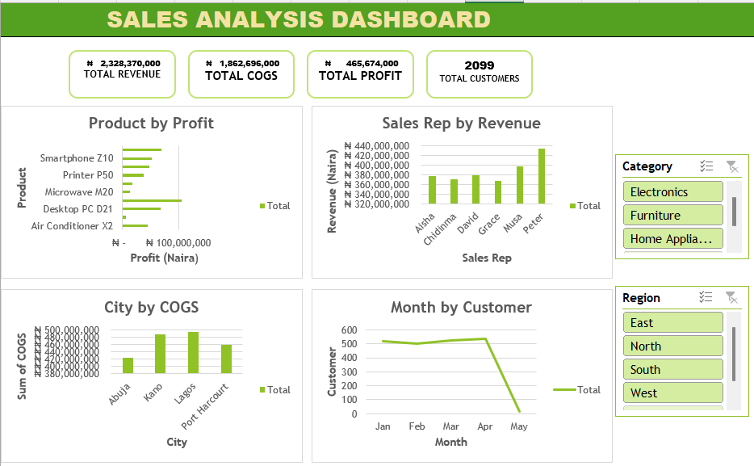
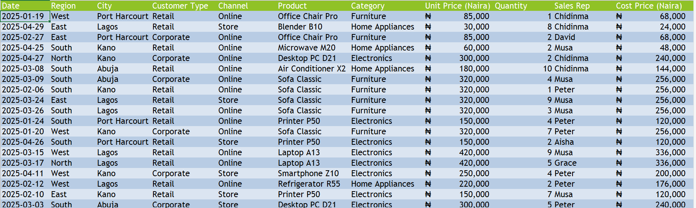
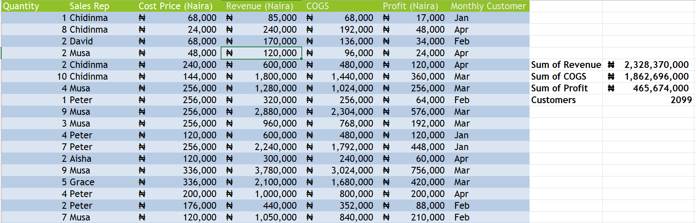

# Sales Performance Dashboard (Excel)

## Project Overview

This project presents a sales analysis dashboard built using Microsoft Excel. The goal is to analyze business performance across products, sales representatives, cities, and time periods.

## Dataset Description

The dataset contains transactional sales data including:

* Date
* Region
* City
* Customer Type
* Product
* Category
* Unit Price
* Quantity
* Sales Representative
* Cost Price

## Objectives

* Calculate key business metrics (KPIs)
* Identify the most profitable product
* Evaluate sales performance by sales representatives
* Analyze cost distribution across cities
* Identify the worst performing month

## Key Metrics (KPIs)

* Total Revenue
* Total Cost of Goods Sold (COGS)
* Total Profit
* Total Customers

## Dashboard Features

* Product by Profit analysis
* Sales Rep by Revenue analysis
* City by COGS visualization
* Monthly customer trend analysis
* Interactive slicers for Region and Category

## Tools Used

* Microsoft Excel
* Pivot Tables
* Charts
* Slicers

## Dashboard Preview

## Key Insights

* Smartphone Z10 is the most profitable product
* Peter is the top-performing sales representative
* Lagos has the highest cost of goods sold

## Conclusion

This dashboard provides a clear and interactive way to analyze sales performance and support business decision-making.
